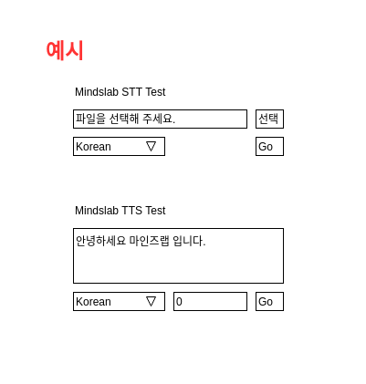

# Mindslab 웹 개발자 코딩테스트

본 코딩테스트는 Mindslab 웹 개발자 선발을 위한 코딩테스트 입니다. 정해진 시간내에 주어진 과제를 어떻게 해결하느냐에 대한 테스트입니다. 정답이 정해진 것이 아니니 요구사항을 읽고 자유롭게 제출해 주시길 바라겠습니다.

### 시험 요령

추후 지원자들에게 시험 시간이 공지될 것입니다. 제출은 공지받은 이메일로, 모든 코드와 관련 데이터를 zip으로 묶어 보내주시면 되겠습니다.

## 과제 내용

### 개요

마인즈랩에서 새로 개발한 STT(Speech-To-Text) 엔진과 TTS(Text-To-Speech) 엔진을 테스트 하기 위하여 간단한 socket서버의 형태로 구성하였다. 마인즈랩 전사 인원이 이 데모에 동참할 수 있도록 Spring FrameWork를 사용하여 간단한 음성 또는 문장을 전송하여 결과를 전송하는 웹 데모 페이지를 작성하여라.

### 과제 요령

- STT와 TTS엔진은 python으로 구현되어 있다. 기본적으로 로컬호스트에 각각 7000, 8000 포트에 서있다.
- 서버를 켜는 방식은 python을 설치한 뒤 아래와 같이 명령어를 입력하면 된다.

```
python brain-{}-server.py
```

- 기본적으로 각 서버는 json request를 받고, 허용되는 기본적인 형태는 아래와 같다.

```
STT Request
{
    "lang":"",      ## kor 또는 eng
    "content":"",   ## 더미 데이터
}

TTS Request
{
    "lang":"",  ## kor 또는 eng
    "voice":0,  ## 0 ~ 122 사이의 숫자
    "text":""   ## TTS 대상 문자열
}
```

- 서버는 응답으로 성공 여부에 대하여 json response를 보내게 된다.

```
{
    "success": boolean
}
```

### 필수 요구사항

- STT와 TTS서버에 대하여 json 형식의 request를 보낼 수 있는 페이지의 작성.
- UI는 복잡할 필요 없이 최소한의 기능만을 제공.



### 추가 요구사항

- STT와 TTS 서버의 ip와 port가 변경될 때를 위한 유지보수 방식 제안 및 구현.
- 각 서버와의 음성 파일 교환 방식.
- STT, TTS의 결과를 보여줄 수 있는 형태 구현.
- STT, TTS의 결과를 받을 수 있는 형태 구현.
- POST 형식의 HTTP Request를 보낼 수 있도록 변환.
- 기본적인 로그인 페이지의 구현.
- 접속 가능 ip 또는 사용자가 저장된 임의의 DB와의 연동.

### 제출 요령

- 서버 상에서 실행가능한 jar 파일
- 완료된 요구사항들에 대한 체크리스트(포함된 csv 파일에 a, b, c의 등급으로 작성)

### 상세 설명

- checklist의 경우 완성도를 직접 판단하여 작성하시면 됩니다. c의 경우는 손대지 않았다고 판단합니다.
- 체점의 편의를 위해 서버에 제출된 코드를 폴더별로 올리고, 스크립트를 활용해 차례대로 사이트를 실행하게 됩니다. 코드의 경우 자유롭게 수정하실 수 있으나, 파일명은 수정하지 말아주시길 바랍니다.
- 프로젝트를 완성하고 실행 가능한 jar 파일을, **특별한 인자없이 실행될 수 있도록** 작성하여 주시길 바랍니다. (기본 포트는 5000으로 설정해주세요!)
- 본 테스트는 제한시간을 일부러 짧게 잡고 진행합니다.
- 당장의 완성된 페이지가 아닌 그림을 그리는 단계라고 생각하시고 풀이하시길 바랍니다(UI에 신경을 많이 쓰지 말아주세요!).
- **단순히 요구사항을 만족한다고 높게 평가되는것은 아닙니다.** 필수 요구사항을 우선적으로 만족하신 뒤, 시간 여하에 따라 할 수 있는 추가 요구사항을 진행하여 주시기 바랍니다.
- 본 과제와 관련된 질문은 **일절 받지 않습니다**.
